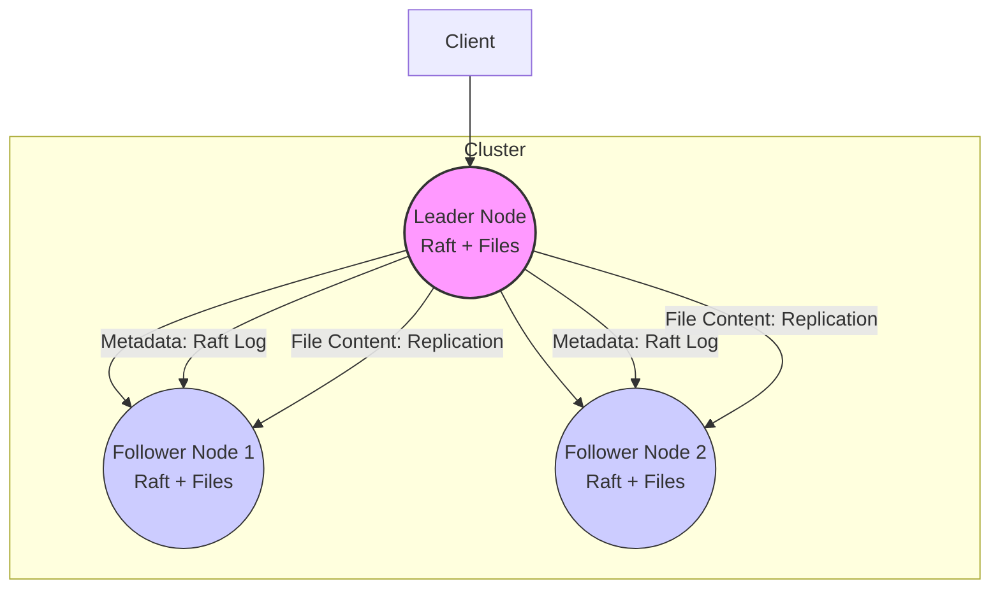

# Simple Distributed File System with Raft

This project is a simple implementation of a **Distributed File System (DFS)** in Go. It uses the **Raft consensus algorithm** to replicate **file metadata** (creations, deletions, etc.) across a cluster of nodes, ensuring consistency and fault tolerance.

Unlike basic metadata-only systems, this implementation also replicates **file content** from the leader to all follower nodes, improving availability and durability.

The Raft layer is based on a modified version of Phil Eaton's `goraft`.

---

## ✨ Key Features

- **Raft-based Metadata Replication**
  File operations (create, delete) are committed to a distributed log via Raft, ensuring metadata is strongly consistent across the cluster.

- **Leader Election**
  Nodes elect a leader automatically. All write operations go through the leader, while reads can be served from any replica.

- **File Content Replication**
  When a file is uploaded, the leader replicates its content to all followers. This ensures that file data is not lost if the leader crashes.

- **Fault Tolerance**
  The system tolerates up to `(N-1)/2` failures in a cluster of size `N`. Both metadata and file content remain available as long as a quorum survives.

- **Simple HTTP API**
  Interact with the DFS using REST-like endpoints for upload, download, delete, list, and status checks.

---

## 🏗️ Architecture Overview (ASCII)

```
  +----------------+
  |     Client     |
  +-------+--------+
          |
          v
  +-------+--------+
  |   Leader Node  |
  | (Raft + Files) |
  +---+-------+----+
      |       |
      |       |
+--------+   +--------+
      v               v
+----+----+         +----+----+
| Follower |         | Follower |
| (Raft +  |         | (Raft +  |
|  Files)  |         |  Files)  |
+----------+         +----------+
```

**Metadata:** Replicated via Raft log  
**File Content:** Replicated from Leader → Followers  
**Reads:** Can be served from any node

---

## 🏗️ Architecture Overview (Mermaid)



**Metadata:** Replicated via Raft log  
**File Content:** Replicated from Leader → Followers  
**Reads:** Can be served from any node

---

## 🚀 Prerequisites

- **Go**: Version 1.20+
- **PowerShell**: To run the cluster startup script on Windows
- **curl**: For quick testing of the HTTP API

---

## ⚡ Running the Cluster

### 1. Build the Application

```sh
go build -o dfsapi.exe .
```

### 2. Start the Cluster

```sh
.\start-cluster.ps1
```

This launches 3 nodes:

- Node 1 → `http://localhost:8081` (Raft RPC on `:3030`)
- Node 2 → `http://localhost:8082` (Raft RPC on `:3031`)
- Node 3 → `http://localhost:8083` (Raft RPC on `:3032`)

---

## 🧪 Testing the File System

### 1. Find the Leader

```sh
curl http://localhost:8081/status
```

Look for `"is_leader": true`.

### 2. Upload a File

```sh
echo "hello distributed world" > my-test-file.txt
curl -X POST --data-binary @my-test-file.txt http://localhost:8081/upload/my-first-file.txt
```

### 3. List Files (from any node)

```sh
curl http://localhost:8082/files
```

### 4. Download from a Follower

```sh
curl http://localhost:8083/upload/my-first-file.txt
```

---

##  Future Improvements

This DFS is functional but still simplified compared to production systems like HDFS or GFS. Potential extensions include:

- **Chunking & Sharding**
  Split large files into fixed-size chunks and distribute them across nodes for better scalability.
- **Configurable Replication Factor**
  Store file data on a subset of nodes (e.g., RF=3) instead of all nodes, saving storage while preserving redundancy.
- **Background Repair & Recovery**
  Periodically verify replicas with checksums and automatically repair missing or corrupted chunks.
- **Dynamic Cluster Membership**
  Allow nodes to join or leave the cluster at runtime without restarting.
- **Read Consistency Options**
  Add strong, eventual, or leader-only read modes depending on application needs.
- **Versioning & Logical Clocks**
  Use Lamport or Hybrid Logical Clocks to support file updates, version tracking, and conflict resolution.

